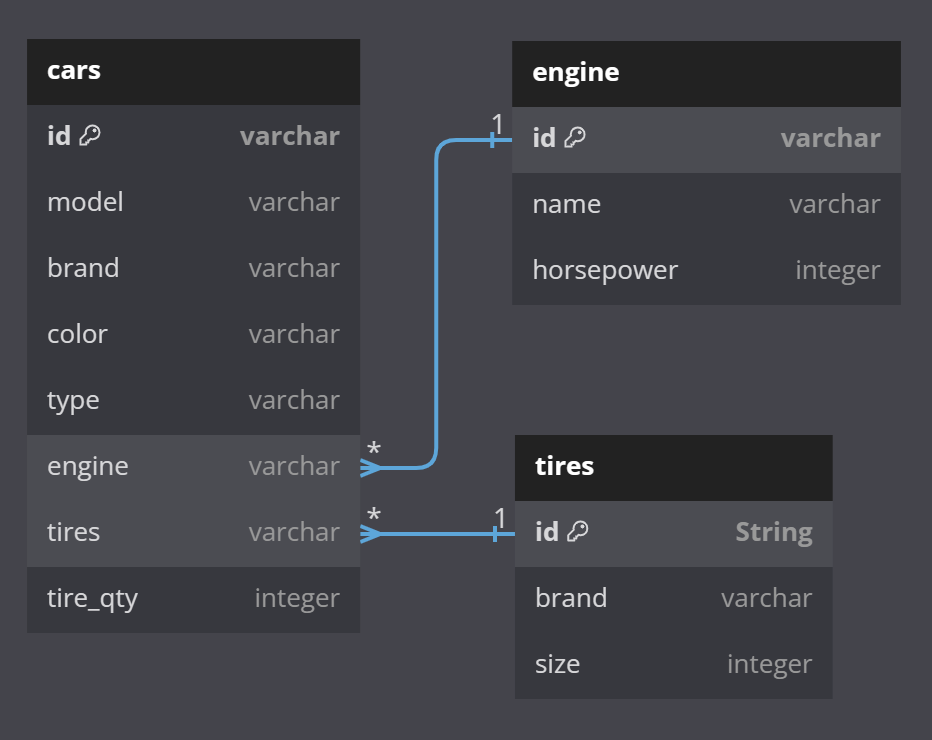

# 1. Quick Start - Webservice Links
To access data based on given requirements:

* GET Electrical Car - http://localhost:8080/cars/electrical
* GET 2 Wheel Car - http://localhost:8080/cars/2wheel
* GET Sport Car - http://localhost:8080/cars/sport

# 2. Requirements Analysis

_Question: Write a restful webservice that gets car type and returns a car from it._

_Notes:_
* _Car type can be electrical, 2 wheels or sport_
* _Each car type might have different parts_
* _You are free to make any assumption, for example about car parts but please mention it in your answer_

Analysis:
1. Since this is a technical assessment, I assume that the question is straightforward and wants a webservice that accepts a request with a car type, then returns exactly 1 car based on the given type.
2. In a realistic scenario, I assume it would either return a list of cars with the requested type, or perhaps a randomly selected car would be returned with that specific type. However, this is not implemented in the solution provided as the mock data is only for demonstration.
3. Car types can have different parts, so the solution only includes Engine and Tires as parts for the sake of demonstration only (since realistically there would be a lot more parts involved).
4. A database is simulated for this demo via hardcode so that the program would work easily without needed to set up a database connection. However, realistically there should be a database for this solution, and technical details for how this should be implemented can be found in the additional notes section below.

# 3. Additional Notes

As mentioned in point 4 above, the provided code merely simulates a DB. However, if we were to have a database set up for this project, the schema would look something like this:

### 3.1 Controller Layer
The controller is set up to only accept one parameter due to the simplistic nature of requirements. If additional security is required, there could also be a validation layer implemented or a post request could be used instead with the data being stored in the request body rather than in the request path itself.

The controller can also be set up with custom Response Entities to display more accurate error messages if the request is bad. However, depending on the situation, too much detailed information on errors could result in security concerns. For this exercise, detailed responses are not implemented.

### 3.2 Service Layer
In this exercise, the `simulateDatabase()` is used to generate a dummy database. However, ideally we would use a database to store all of this information. Assuming that a database has been set up, the service layer would call a repository in order to extract information from a database.

Example code for DB implementation:

    @Autowired
    private CarRepository carRepository;

    public List<Car> getCarsByType(String carType) {
        return carRepository.findByType(carType);
    }

### 3.3 Bean Inclusion
Assuming that a database is included, rather than a model, we would require a bean entity to map to the columns in the DB. Example code:
    
    @Entity
    @Table(name = "cars")
    public class Car {
    
        @Id
        @GeneratedValue(strategy = GenerationType.IDENTITY)
        private String id;

        @Column
        private String model;

        @Column
        private String brand;

        @Column
        private String color;

        @Column
        private String type;

        @ManyToOne
        @JoinColumn(name = "engine_id")
        private Engine engine;

        @ManyToOne
        @JoinColumn(name = "tires_id")
        private Tires tires;

        @Column(name = "tire_qty")
        private int tireQty;
    }

It is important to note that the Engine and Tires (Car parts) columns would be foreign keys in the database, therefore the sql query to extract this information must be tailored accordingly.

### 3.4 Repository Inclusion
Assuming that a database is included, a sample repository using Jpa would be as follows:
    
    @Repository
    public interface CarRepository extends JpaRepository<Car, String> {
        
        @Query("SELECT c FROM Car c JOIN FETCH c.engine e JOIN FETCH c.tires t WHERE c.type = :type")
        List<Car> findByType(@Param("type") String type);

    }

**In my previous experience, Jpa is not really used, instead we wrote custom queries and executed them via QueryBuilder, so I'm not exactly sure if the above code would work in practice.** 

If I were to write custom queries instead using query builder, the following can be done.

Here is an SQL query to extract car information assuming that Engine and Tire columns are the ids as foreign keys:

    SELECT c.*, e.*, t.*
    FROM CARS c
    LEFT JOIN ENGINE e ON c.engine = e.id
    LEFT JOIN TIRES t ON c.tires = t.id
    WHERE c.type = 'electrical';

With this information, the service layer can then create a car object as well as part objects as required, then add the parts information to the car and return it.

